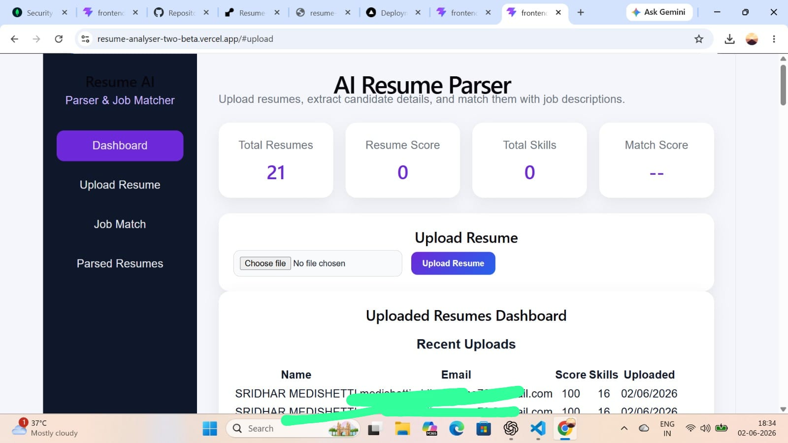
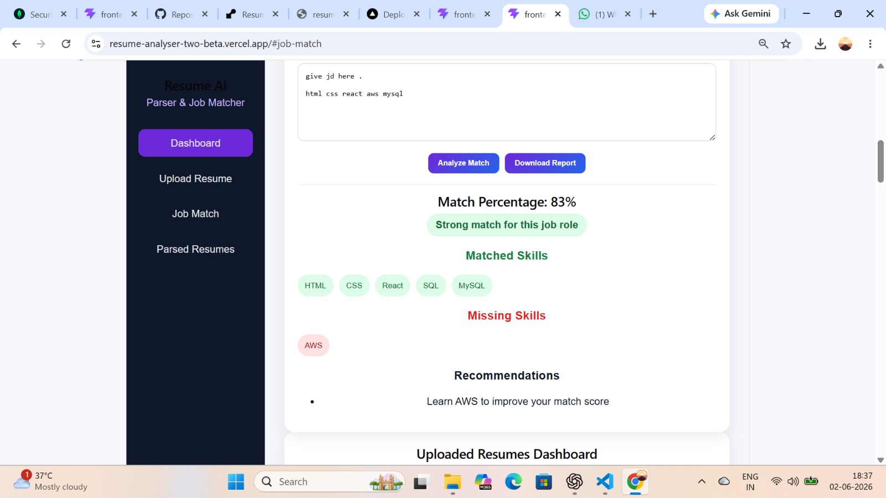
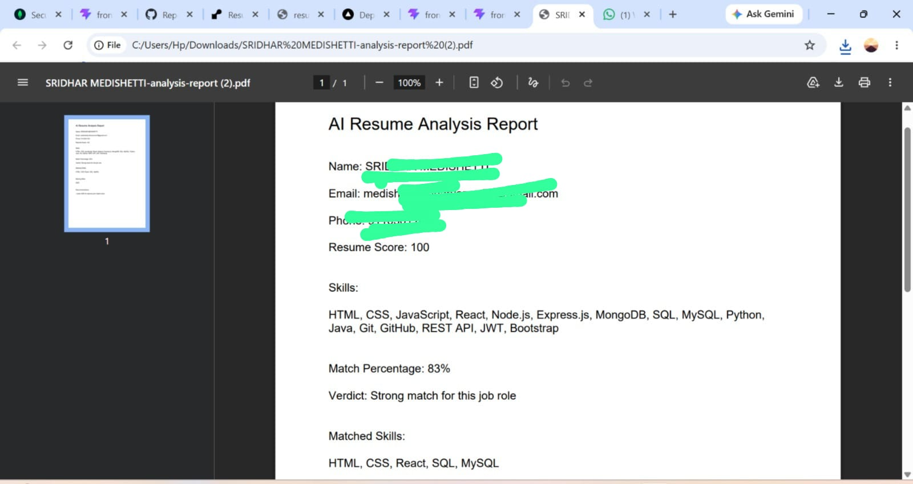

# AI Resume Parser & Job Match Analyzer

## Live Demo

Frontend:
https://resume-analyser-two-beta.vercel.app

Backend:
https://resume-analyser-zm57.onrender.com

## Overview

AI Resume Parser & Job Match Analyzer is a full-stack MERN application that automates resume screening and candidate evaluation.

The application allows users to upload PDF or DOCX resumes, automatically extracts candidate information, stores parsed data in MongoDB, analyzes resume quality, and compares candidate skills against job descriptions to generate match scores and recommendations.

The platform provides recruiters and job seekers with a streamlined way to evaluate resumes and identify skill gaps.

---

## Key Features

### Resume Parsing

* Upload PDF and DOCX resumes
* Extract candidate information automatically
* Extract:

  * Name
  * Email
  * Phone Number
  * Skills
  * Education
  * Experience

### Resume Analytics

* Resume score calculation
* Resume improvement suggestions
* Skills visualization
* Resume dashboard

### Job Description Matching

* Compare resume skills with job requirements
* Match percentage calculation
* Missing skill detection
* Matched skill identification
* Personalized recommendations
* Match verdict generation

### Resume Management

* View uploaded resumes
* Search resumes by:

  * Name
  * Email
  * Skill
* Delete resumes
* Recent uploads table

### Report Generation

* Download resume analysis as PDF
* Export:

  * Resume score
  * Match percentage
  * Missing skills
  * Recommendations
  * Verdict

---

## Dashboard Screenshots

### Main Dashboard

### Job Matching

### PDF Report

---

## Technology Stack

### Frontend

* React.js
* Axios
* CSS3
* jsPDF

### Backend

* Node.js
* Express.js

### Database

* MongoDB Atlas
* Mongoose

### File Processing

* Multer
* PDF Parser
* Mammoth (DOCX Parsing)

### Deployment

* Vercel
* Render
* MongoDB Atlas

---

## Project Architecture

Frontend (React)

↓

REST APIs

↓

Express.js Backend

↓

Resume Parsing Engine

↓

MongoDB Atlas

---

## API Endpoints

### Upload Resume

POST /api/resumes/upload

Uploads and parses a resume.

### Get All Resumes

GET /api/resumes

Returns all stored resumes.

### Match Resume

POST /api/resumes/match/:id

Matches resume against a job description.

### Delete Resume

DELETE /api/resumes/:id

Deletes a stored resume.

---

## Installation

### Clone Repository

git clone https://github.com/Sridhar-medishetti/Resume-analyser.git

### Install Backend Dependencies

cd backend

npm install

### Install Frontend Dependencies

cd frontend

npm install

### Configure Environment Variables

Create a .env file inside backend:

MONGO_URI=YOUR_MONGODB_CONNECTION_STRING

### Run Backend

npm run dev

### Run Frontend

npm run dev

---

## Deployment

### Frontend

Hosted on Vercel

### Backend

Hosted on Render

### Database

Hosted on MongoDB Atlas

---

## Future Enhancements

* JWT Authentication
* Role-Based Access Control
* Advanced NLP Resume Analysis
* AI Interview Question Generator
* Resume Ranking System
* Candidate Comparison Dashboard

---

## Author

Sridhar Medishetti

GitHub:
https://github.com/Sridhar-medishetti

LinkedIn:
https://www.linkedin.com/in/sridhar-medishetti/

---

## License

This project is developed for educational and portfolio purposes.
